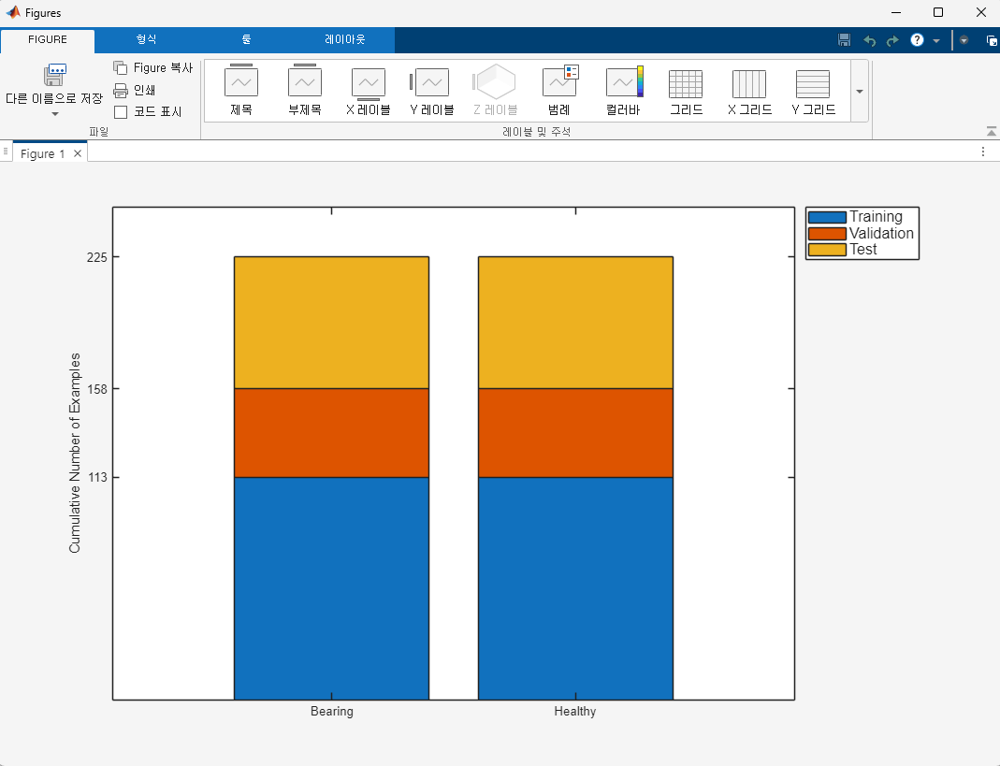
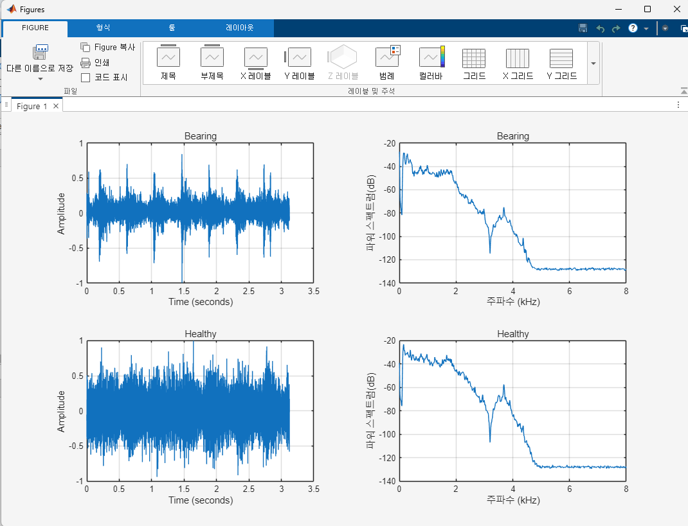
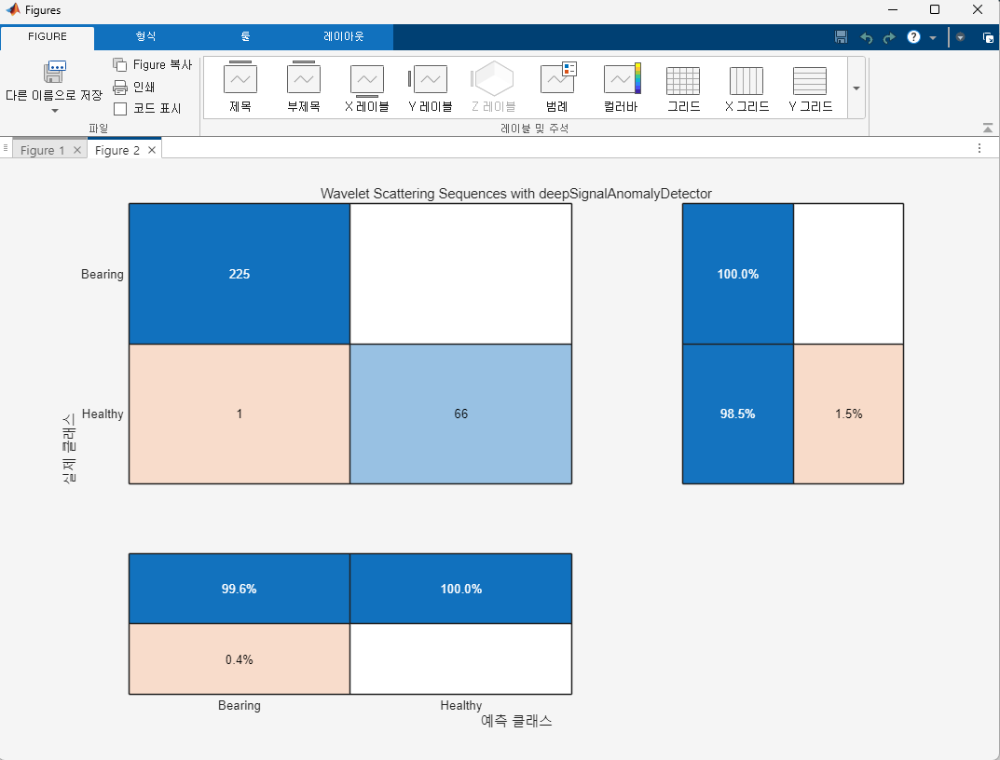
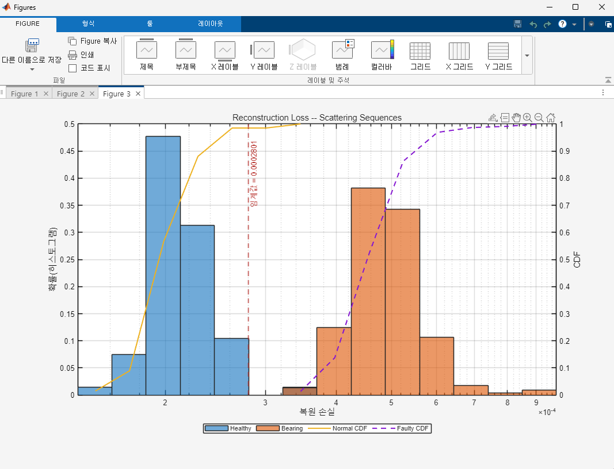

# Wavelet Scattering Anomaly Detection

## 프로젝트 소개

산업 설비의 상태를 모니터링하고 이상 징후를 조기에 탐지하기 위해 Wavelet Scattering Transform과 Convolutional Autoencoder를 활용한 이상 탐지 모델을 개발한 프로젝트입니다.

Air Compressor Dataset의 정상(Healthy) 및 베어링 결함(Bearing) 데이터를 활용하여 정상 상태와 이상 상태를 구분할 수 있는 모델을 구현하였습니다.

---

## 개발 목적

* 산업 설비 이상 탐지 모델 구현
* 신호처리 기반 특징 추출 기법 학습
* Autoencoder 기반 이상 탐지 기법 적용
* 예방정비(Predictive Maintenance) 기술 이해

---

## 사용 기술

### Development Environment

* MATLAB

### AI / Signal Processing

* Wavelet Scattering Transform
* Convolutional Autoencoder
* Deep Learning Toolbox
* Signal Processing

---

## 데이터셋

* Air Compressor Dataset
* Healthy (정상 상태)
* Bearing (베어링 결함 상태)

학습 데이터 50%, 검증 데이터 20%, 테스트 데이터 30%로 분할하여 실험을 수행하였습니다.

---

## 주요 기능

### 데이터 전처리

* 오디오 기반 진동 데이터 불러오기
* 데이터셋 분할 및 클래스 관리

### 특징 추출

* Wavelet Scattering Transform 적용
* 시간-주파수 영역 특징 추출

### 모델 학습

* Convolutional Autoencoder 설계
* 정상 데이터 기반 학습 수행

### 이상 탐지

* Reconstruction Loss 기반 이상 탐지
* 정상/이상 상태 분류

---

## 담당 역할

* 데이터셋 전처리
* Wavelet Scattering 특징 추출
* Autoencoder 모델 설계
* 모델 학습 및 성능 평가
* 결과 분석 및 시각화

---

## 실험 결과

### 1. 데이터셋 분포

Train, Validation, Test 데이터셋으로 분할 후 클래스 분포를 확인하였습니다.

---

### 2. 정상 상태와 결함 상태 비교

Healthy(정상)와 Bearing(결함) 데이터의 파형 및 주파수 특성을 비교하였습니다.

---

### 3. Reconstruction Loss 비교

정상 데이터와 결함 데이터의 재구성 오차를 비교하여 이상 탐지 성능을 확인하였습니다.

---

### 4. Confusion Matrix

실제 라벨과 예측 결과를 비교하여 모델의 이상 탐지 성능을 평가하였습니다.

---

## 프로젝트 성과

Wavelet Scattering Transform을 활용하여 진동 데이터의 특징을 효과적으로 추출할 수 있었으며, Convolutional Autoencoder 기반 이상 탐지 모델을 통해 정상 상태와 결함 상태를 구분하는 시스템을 구현하였습니다.

또한 신호처리 기법과 딥러닝 모델을 결합하여 산업 설비 예방정비 분야에 활용 가능한 이상 탐지 기법을 경험할 수 있었습니다.

---

## 배운 점

본 프로젝트를 통해 신호처리 기반 특징 추출 방법과 Autoencoder를 활용한 이상 탐지 기법을 학습하였습니다. 또한 실제 산업 설비 데이터를 활용하여 데이터 전처리, 모델 학습, 성능 평가까지 AI 프로젝트 전 과정을 경험할 수 있었습니다.
